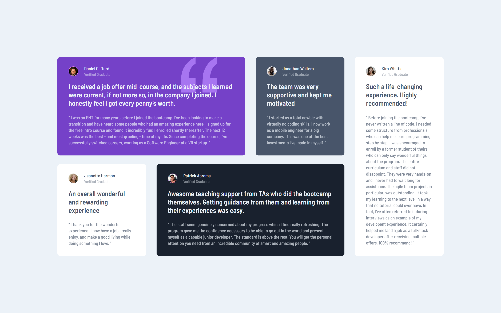

# Frontend Mentor - Testimonials Grid Section Solution

This is my solution to the [Testimonials Grid Section challenge on Frontend Mentor](https://www.frontendmentor.io/challenges/testimonials-grid-section-Nnw6J7Un7). Frontend Mentor challenges are an excellent way to enhance your coding skills by working on real-world projects.

## Table of Contents

- [Overview](#overview)
  - [The Challenge](#the-challenge)
  - [Screenshot](#screenshot)
  - [Links](#links)
- [My Process](#my-process)
  - [Built With](#built-with)
  - [What I Learned](#what-i-learned)
  - [Continued Development](#continued-development)
  - [Useful Resources](#useful-resources)
- [Author](#author)
- [Acknowledgments](#acknowledgments)

## Overview

### The Challenge

Users should be able to:

- View the optimal layout for the site depending on their device's screen size.

### Screenshot



### Links

- Solution URL: [Solution on Frontend Mentor](https://www.frontendmentor.io/solutions/testimonials-grid-section-using-flexbox-and-css-grid-D4x3Qp5v8)
- Live Site URL: [Live site here](https://jomagene.github.io/testimonial-grid/)

## My Process

### Built With

- Semantic HTML5 markup
- CSS custom properties
- Flexbox
- CSS Grid
- Mobile-first workflow

### What I Learned

I learned the importance of specificity in CSS. I encountered an issue where styles applied to the desktop view weren’t displaying correctly because the mobile styles were more specific. Here’s an example of the media query I used:

```css
@media (min-width: 64rem) {
  main {
    grid-template-columns: repeat(4, 1fr);
    gap: 1.5625rem 1.875rem;
  }
  .bg-violet {
    grid-column: 1 / span 2;
  }
  .bg-blackish-blue {
    grid-column: 2 / span 2;
  }
  article.last {
    grid-area: 1 / 4 / span 2;
  }
}
```

### Continued Development

In future projects, I aim to focus more on understanding and applying CSS specificity correctly from the start, particularly when dealing with responsive designs. Additionally, I want to explore more advanced CSS Grid techniques to handle complex layouts more efficiently.

### Useful Resources

- [MDN Web Docs - CSS Specificity](https://developer.mozilla.org/en-US/docs/Web/CSS/Specificity) - This resource helped me understand how CSS specificity works and how it affects the application of styles in different media queries.
- [CSS-Tricks - A Complete Guide to CSS Grid](https://css-tricks.com/snippets/css/complete-guide-grid/) - An amazing guide that helped me better understand CSS Grid and how to use it effectively in responsive layouts.
- [Conquering Responsive Layouts by Kevin Powell](https://courses.kevinpowell.co/view/courses/conquering-responsive-layouts) - This course was incredibly helpful in deepening my understanding of responsive design. Kevin Powell's explanations are clear and practical, making it easier to apply responsive techniques in real-world projects.

## Author

- Frontend Mentor - [@Jomagene](https://www.frontendmentor.io/profile/Jomagene)
- Twitter - [@Jomagene](https://www.twitter.com/Jomagene)

## Acknowledgments

I want to thank the Frontend Mentor community for providing feedback and suggestions that helped me refine this project. Their insights were invaluable in improving my approach to the challenge.
